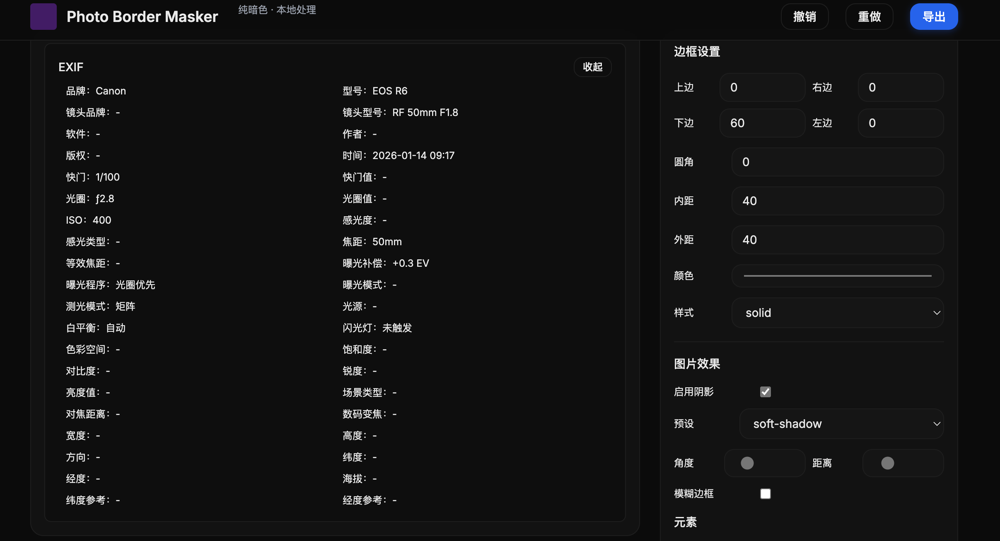
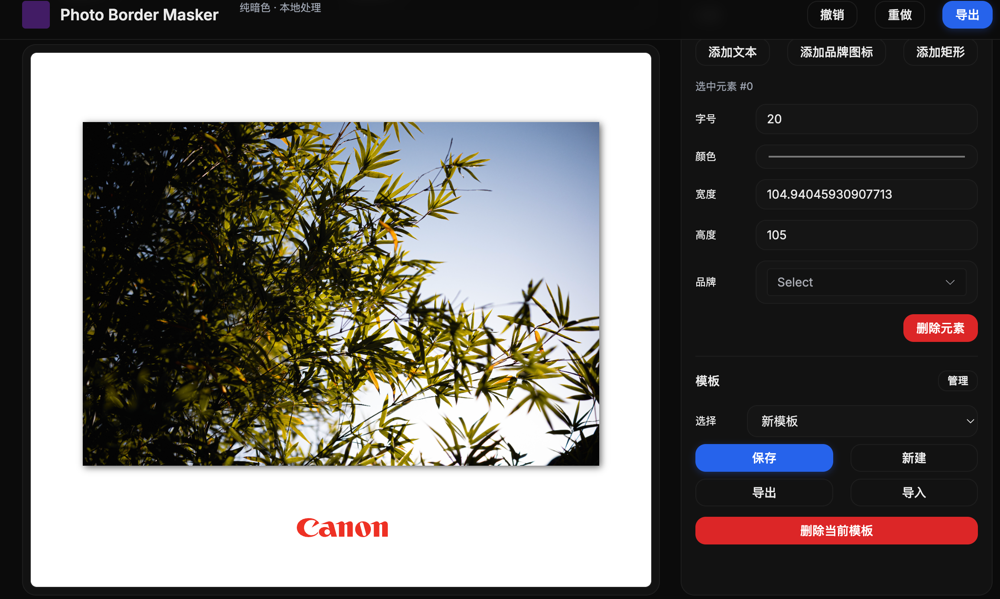

# Photo Border Masker

一个基于 Vue 3 + Vite + Konva 的图片边框与 EXIF 信息生成工具。致力于为摄影作品添加精美的边框、阴影以及拍摄参数信息（EXIF），让照片分享更具质感。

## ✨ 功能特点

- **🖼️ 智能图片处理**
  - 支持拖拽上传图片
  - 自动读取并解析 EXIF 信息（相机品牌、型号、镜头、光圈、快门、ISO、拍摄时间等）
  - 本地处理，保护隐私

- **🎨 强大的边框编辑器**
  - 自定义边框颜色、宽度
  - 支持圆角设置
  - 可调节内边距（Padding）和外边距（Margin）
  - 支持背景纹理或纯色背景

- **🌑 阴影与光效**
  - 可自定义阴影颜色、模糊度、偏移量
  - 预设多种阴影风格

- **📝 文本与水印**
  - 自动生成 EXIF 参数文本
  - 支持自定义添加文本元素
  - 内置主流相机品牌 Logo（Canon, Sony, Nikon, Fujifilm, Leica 等）

- **💾 模板系统**
  - 支持保存当前设计为模板
  - 支持导入/导出 JSON 格式模板，方便分享与复用
  - 拖拽 JSON 文件即可应用模板

- **👁️ 实时预览**
  - 基于 Konva.js 的高性能 Canvas 渲染
  - 所见即所得的编辑体验

## 📸 预览




## 🛠️ 技术栈

- **核心框架**: [Vue 3](https://vuejs.org/)
- **构建工具**: [Vite](https://vitejs.dev/)
- **UI 组件库**: [Element Plus](https://element-plus.org/)
- **样式库**: [Tailwind CSS](https://tailwindcss.com/)
- **图形渲染**: [Konva.js](https://konvajs.org/)
- **状态管理**: [Pinia](https://pinia.vuejs.org/)
- **EXIF 解析**: [exifr](https://github.com/MikeKovarik/exifr)

## 🚀 快速开始

### 环境要求

- Node.js >= 16

### 安装依赖

```bash
cd pbm-vite
npm install
```

### 启动开发服务器

```bash
npm run dev
```

### 构建生产版本

```bash
npm run build
```

## 📂 目录结构

```
pbm-vite/
├── src/
│   ├── assets/          # 静态资源（Logo、示例图等）
│   ├── components/      # Vue 组件
│   ├── composables/     # 组合式函数 (Hooks)
│   ├── router/          # 路由配置
│   ├── stores/          # Pinia 状态管理
│   ├── utils/           # 工具函数
│   └── views/           # 页面视图
├── dist/                # 构建产物
└── ...
```

## 📄 License

[MIT](./LICENSE)
